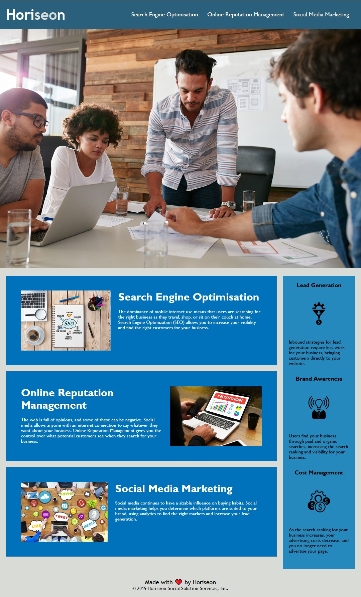

# Challenge 1 - Refactoring existing code for accessibility purposes 

## Description
This is the 1st weekly challenge for UOB's Front End Developr and UX Bootcamp concerning accessibility. 
The codebase for a marketing agency's website is given and the purpose is to change it to follow accessibility standards and make it optimised for search engines.
The challenge is designed to prepare the developer for a scenario they will encounter in their career as a Front-End Software Engineer/Developer:

* On-the-job tickets or feature requests.

The challenge follows agile project management conventions where it provides a user story, acceptance criteria, a mock-up demonstrating the application's functionality, and review guidelines.

## Table of Contents 

[Installation](#installation)
[Usage](#usage)
[Credits](#credits)
[License](#license)

### Installation

The steps required to complete the project are as goes: 

* Semantic HTML elements are found throughout the source code. 
* HTML elements follow a logical structure independent of styling or positioning.
* Image and icon elements contain accessible 'alt' attributes.
* Heading attributes fall in sequential order. 
* Title elements contain a concise, descriptive title. 

### Usage

The Horiseon page is used as a marketing agency's front page where you can access different topics such as:

* Search Engine Optimization
* Online Reputation Management
* Social Media Marketing

You can find these by using the links on the header of the page.

It also includes some reasons for wanting to choose Horiseon as your marketing agency on a column at the bottom right.

Screenshot of the page attached for reference:

